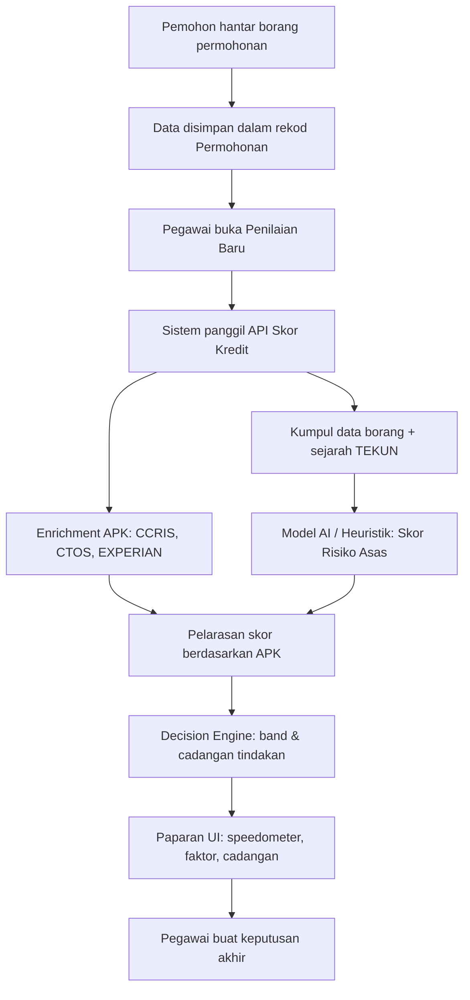

# Skrip Pembentangan: Sistem Skor Kredit AI (SPPT)

**Untuk:** Stakeholder TEKUN Nasional (Pengurusan, Pegawai Penilaian, IT, Audit)  
**Modul:** Penilaian & Kelulusan — Skor Kredit AI (Spec 2.1.1)  
**Tempoh Cadangan:** 15–20 minit  
**Tarikh:** _______________  
**Pembentang:** _______________

---

## Persiapan Sebelum Pembentangan

- [ ] Pastikan persekitaran dev berjalan (`composer dev` / `composer dev:win`)
- [ ] Buka halaman **Penilaian Baru**: `/admin/pembiayaan/penilaian/baru`
- [ ] Login sebagai pegawai admin (contoh: `admin@example.com`)
- [ ] Pilih satu permohonan contoh (cth. Siti Nurhaliza — P-2024-002)
- [ ] Tunggu panel **Skor Kredit AI** dimuatkan (speedometer, CCRIS/CTOS/EXPERIAN, senarai faktor)
- [ ] Sediakan salinan dokumen ini untuk rujukan semasa Q&A

---

## 1. Ringkasan Eksekutif (2 minit)

### Naratif Pembentang

> *"Yang dihormati,*
>
> *Sistem Skor Kredit AI dalam SPPT adalah alat **sokongan keputusan** untuk pegawai penilaian — bukan keputusan automatik muktamad. Ia membantu pegawai menilai risiko kredit dengan lebih pantas, konsisten, dan telus.*
>
> *Skor dipaparkan sebagai nombor 0–100, kategori risiko (Rendah / Sederhana / Tinggi), had pembiayaan dicadangkan, dan cadangan tindakan Decision Engine — sama ada Auto-Lulus (cadangan), Semakan Pegawai, atau Tolak/Eskalasi.*
>
> *Pegawai tetap membuat keputusan akhir. Sistem hanya mengumpul data, mengira skor, dan menerangkan faktor-faktor yang mempengaruhi keputusan."*

### Tiga Mesej Utama

| # | Mesej | Kenapa Penting |
|---|-------|----------------|
| 1 | **Sokongan, bukan pengganti** | Mematuhi tadbir urus kewangan awam dan prinsip human-in-the-loop |
| 2 | **Data bersepadu** | Gabungan borang permohonan, sejarah TEKUN, dan agensi pelaporan kredit (APK) |
| 3 | **Ketelusan** | Setiap skor disertai senarai faktor (Sejarah Pembayaran, Status Muflis, dll.) yang boleh diaudit |

---

## 2. Dua Peringkat Skoring dalam SPPT

SPPT mempunyai **dua lapisan** penilaian AI yang berbeza masa dan tujuan:

| Aspek | Skor Risiko Awal (Spec 1.6.3) | Skor Kredit (Spec 2.1.1) |
|-------|-------------------------------|---------------------------|
| **Bila dijalankan** | Semasa pemohon hantar permohonan (portal) atau semakan kelayakan awal | Semasa pegawai buat **Penilaian Baru** |
| **Data APK (CCRIS/CTOS/EXPERIAN)** | Tidak digunakan | **Digunakan** — enrichment automatik |
| **Decision Engine** | Tiada | **Ada** — Auto-Lulus / Semakan Pegawai / Tolak-Eskalasi |
| **Paparan UI** | Portal Pemohon → Semakan Kelayakan | Admin → Pembiayaan → Penilaian Baru |
| **Disimpan dalam** | `permohonan.details.ai_risk_scoring` | `permohonan.details.ai_credit_scoring` |

> **Untuk stakeholder:** Fokus pembentangan ini adalah **Skor Kredit (2.1.1)** — lapisan penilaian penuh yang pegawai gunakan semasa membuat keputusan kelulusan.

---

## 3. Aliran Kerja Skor Kredit

### Naratif Ringkas

> *"Apabila pegawai memilih permohonan di skrin Penilaian Baru, sistem secara automatik:*
> 1. *Membaca maklumat dari borang permohonan yang pemohon isi*
> 2. *Menambah sejarah pembiayaan TEKUN sedia ada (jika ada)*
> 3. *Mendapatkan rekod kredit luaran melalui APK (CCRIS, CTOS, EXPERIAN)*
> 4. *Mengira skor kredit 0–100 dan menentukan cadangan tindakan*
> 5. *Memaparkan semua faktor penilaian supaya pegawai faham 'mengapa' skor itu diperoleh"*

---

## 4. Dari Mana Maklumat Dikumpul?

Jadual di bawah menerangkan **sumber data** bagi setiap jenis maklumat yang dipaparkan dalam panel faktor (contoh: Sejarah Pembayaran, Status Muflis, Nisbah Hutang, dll.).

### 4.1 Data Borang Permohonan (Pemohon Isi)

| Maklumat | Medan / Sumber | Digunakan Untuk |
|----------|----------------|-----------------|
| No. Kad Pengenalan (MyKad) | `no_ic_baru` / `no_ic` | Kunci carian sejarah TEKUN & APK |
| No. SSM (syarikat) | `no_ssm` / `no_pendaftaran_syarikat` | Enrichment CTOS (litigasi syarikat) |
| Umur | `umur` | Penilaian julat optimum risiko (25–55 tahun) |
| Pendapatan bulanan | `pendapatan`, `pendapatan_bulan`, `pendapatan_pasangan` | Nisbah komitmen, leverage, had dicadangkan |
| Komitmen sedia ada | `jumlah_komitmen_sedia_ada` / `komitmen_bulanan` | Nisbah hutang kepada pendapatan (DSR) |
| Jumlah dipohon | `jumlah_permohonan` | Leverage vs pendapatan tahunan |
| Sektor perniagaan | `sektor_perniagaan` | Profil risiko sektor |
| Tempoh perniagaan | `tempoh_perniagaan_tahun` | Kestabilan perniagaan |
| Status muflis | `muflis` | Penanda kritikal — tolak/eskalasi |
| Negeri | `negeri` | Konteks geografi |
| Kategori pembiayaan | `kategori_pembiayaan` | Konteks produk |

**Di mana diisi:** Portal Pemohon → Wizard Permohonan Baru (BPP-01), atau borang dalaman pegawai.

---

### 4.2 Sejarah Pembiayaan TEKUN (Sistem Dalaman)

| Maklumat | Sumber Database | Cara Dikumpul |
|----------|-----------------|---------------|
| **Sejarah Pembayaran** | Jadual `akaun_pembiayaan` | Carian mengikut IC pemohon; status `aktif`, `tunggakan`, `npf` |
| Bilangan pembiayaan aktif | `akaun_pembiayaan` | Kiraan akaun aktif |
| Jumlah pembiayaan aktif (RM) | `akaun_pembiayaan.jumlah_pembiayaan` | Jumlah nilai pembiayaan |
| Rekod tunggakan / NPF | `akaun_pembiayaan.status`, `tunggakan` | Akaun dengan status tunggakan atau NPF |
| Produk & negeri akaun | `akaun_pembiayaan.produk`, `negeri` | Butiran setiap akaun |

**Contoh output faktor (Sejarah Pembayaran):**

> *"Pemohon mempunyai rekod bayaran sempurna tanpa tunggakan pada pembiayaan sedia ada berjumlah RM80,000."*

**Nota:** Jika pemohon tiada rekod dalam `akaun_pembiayaan`, sistem melaporkan tiada pembiayaan aktif — ini boleh memberi impak positif atau neutral pada skor.

---

### 4.3 Agensi Pelaporan Kredit — APK (Spec 10.1.5)

Data luaran diperoleh melalui **ApkCreditEnrichmentService** menggunakan No. KP (dan No. SSM untuk syarikat).

| Agensi | Maklumat Diperoleh | Kesan pada Skor |
|--------|-------------------|-----------------|
| **CCRIS** (Bank Negara) | Skor kredit, bilangan kemudahan, baki outstanding, komitmen bulanan, tindakan guaman, akaun NPF, Special Attention | Pelarasan ±5 hingga −20 mata; bendera kritikal |
| **CTOS** | Skor kredit, rekod litigasi, rujukan perdagangan negatif | −10 jika litigasi; bendera APK |
| **EXPERIAN** | Skor kredit, rekod tunggakan (delinquency) | −8 jika tunggakan; bendera APK |

**Status POC vs Production:**

| Persekitaran | Sumber APK | Catatan |
|--------------|-----------|---------|
| **POC (semasa)** | Data mock deterministik (berdasarkan hash IC/SSM) | Menunjukkan aliran dan UI; skor konsisten untuk IC sama |
| **Production (dirancang)** | Integrasi langsung APK (Spec 10.1.5) | Data sebenar CCRIS, CTOS, EXPERIAN secara automatik |

> **Untuk stakeholder:** Dalam POC, data CCRIS/CTOS/EXPERIAN adalah simulasi realistik. Dalam fasa production, integrasi APK mandatori akan menggantikan mock dengan data sebenar dari agensi pelaporan kredit.

---

## 5. Bagaimana Skor Kredit Dikira?

Skor akhir 0–100 dibina dalam **tiga peringkat**:

### Langkah 1 — Skor Risiko Asas (0–100)

Model menilai data borang + sejarah TEKUN. Dua mod operasi:

| Mod | Bila Digunakan | Penerangan |
|-----|----------------|------------|
| **AI (Claude)** | `ANTHROPIC_API_KEY` diset dalam `.env` | Model AI menganalisis semua input dan menjana skor + faktor dalam BM |
| **Heuristik (fallback)** | Tiada API key atau AI gagal | Peraturan deterministik SPPT (lihat Jadual 5.1) |

**Prinsip skor:** Lebih **tinggi** = risiko kredit lebih **rendah** (lebih selamat).

#### Jadual 5.1 — Peraturan Heuristik (Fallback)

| Faktor | Syarat | Pelarasan Skor |
|--------|--------|----------------|
| Umur | 25–55 tahun | +8 |
| Umur | <21 atau >60 tahun | −12 |
| Nisbah komitmen/pendapatan | ≤30% | +10 |
| Nisbah komitmen/pendapatan | 31–50% | +4 |
| Nisbah komitmen/pendapatan | 51–70% | −4 |
| Nisbah komitmen/pendapatan | >70% | −15 |
| Pendapatan bulanan | ≥ RM5,000 | +5 |
| Pendapatan bulanan | < RM1,500 | −10 |
| Tempoh perniagaan | ≥3 tahun | +8 |
| Tempoh perniagaan | <1 tahun | −6 |
| Pembiayaan aktif TEKUN | Tiada | +4 |
| Pembiayaan aktif TEKUN | >1 akaun | −8 |
| Tunggakan/NPF TEKUN | Ada | −15 hingga −25 |
| Status muflis | Ya | −30 |
| Leverage (jumlah dipohon / pendapatan tahunan) | >3x | −12 |
| Leverage | >2x | −6 |

Skor asas bermula dari **70** dan dipelaras mengikut faktor di atas, kemudian dihadkan pada julat 0–100.

---

### Langkah 2 — Pelarasan APK

Skor asas **dipelaras** berdasarkan data CCRIS, CTOS, dan EXPERIAN:

| Syarat APK | Pelarasan |
|------------|-----------|
| Skor CCRIS ≥ 700 | +5 |
| Skor CCRIS 550–599 | −6 |
| Skor CCRIS < 550 | −12 |
| Tindakan guaman CCRIS | −20 |
| Akaun NPF CCRIS | −15 |
| Special Attention CCRIS | −8 |
| Litigasi CTOS | −10 |
| Tunggakan EXPERIAN | −8 |

Skor selepas pelarasan = **Skor Kredit Akhir** (0–100).

---

### Langkah 3 — Kategori & Had Pembiayaan Dicadangkan

| Skor Kredit | Kategori Risiko |
|-------------|-----------------|
| 80–100 | Risiko Rendah |
| 60–79 | Risiko Sederhana |
| 0–59 | Risiko Tinggi |

**Had pembiayaan dicadangkan** dikira berdasarkan:
- Pendapatan bulanan pemohon
- Skor kredit (faktor skor)
- Jumlah dipohon
- Had maksimum: 50% pendapatan tahunan atau RM300,000 (mana-mana lebih rendah)

Pegawai boleh klik **"Guna sebagai cadangan"** untuk isi medan cadangan pembiayaan secara automatik.

---

## 6. Decision Engine (Enjin Keputusan)

Selepas skor dikira, **Decision Engine** menentukan **cadangan tindakan** (bukan keputusan muktamad):

| Skor | Bendera Kritikal | Band Warna | Cadangan Tindakan | Label UI |
|------|------------------|------------|-------------------|----------|
| ≥ 80 | Tiada | 🟢 Hijau | Auto-Lulus (Cadangan) | Kelulusan automatik **dicadangkan** — tertakluk semakan pegawai |
| 60–79 | Tiada | 🟡 Amber | Semakan Pegawai | Permohonan dirujuk untuk semakan manual |
| < 60 | — | 🔴 Merah | Tolak / Eskalasi | Risiko tinggi — tolak atau eskalasi kepada pegawai kanan |
| Mana-mana | **Ada** | 🔴 Merah | Tolak / Eskalasi | Walaupun skor sederhana, bendera kritikal mencetuskan eskalasi |

**Bendera kritikal** termasuk:
- Status muflis dalam borang
- ≥2 bendera APK serentak
- Tindakan guaman CCRIS
- Akaun NPF CCRIS

**Ambang boleh dikonfigurasi** melalui `.env`:
- `SPPT_CREDIT_AUTO_APPROVE_MIN` (lalai: 80)
- `SPPT_CREDIT_OFFICER_REVIEW_MIN` (lalai: 60)

---

## 7. Paparan UI — Apa Stakeholder Akan Lihat

Semasa demo di **Penilaian Baru**, tunjukkan komponen berikut:

| Komponen UI | Apa Ia Menunjukkan |
|-------------|-------------------|
| **Banner Decision Engine** | Cadangan tindakan (Semakan Pegawai / Auto-Lulus / Tolak) dengan warna band |
| **Speedometer berwarna** | Skor 0–100: merah (kiri/Tinggi) → amber (tengah/Sederhana) → hijau (kanan/Rendah) |
| **Had Pembiayaan Dicadangkan** | RM dicadangkan oleh model |
| **Keputusan AI + Keyakinan Model** | Cadangan tindakan + peratus keyakinan (confidence) |
| **Panel CCRIS / CTOS / EXPERIAN** | Skor agensi, kemudahan, litigasi, tunggakan |
| **Senarai Faktor** | Bullet points: Sejarah Pembayaran, Status Muflis, Nisbah DSR, Skor CCRIS, dll. |
| **Disclaimer** | *"Skor kredit AI — sokongan keputusan pegawai, bukan keputusan automatik muktamad"* |

---

## 8. Skrip Demo Langsung (8 minit)

### 8.1 Konteks (1 minit)

**Tindakan:** Buka `/admin/pembiayaan/penilaian/baru`

> *"Ini skrin Penilaian Baru. Pegawai penilaian melihat senarai permohonan menunggu penilaian di sebelah kiri. Setiap permohonan membawa data dari borang pemohon dan akan diperkaya dengan data kredit luaran."*

---

### 8.2 Pilih Permohonan (1 minit)

**Tindakan:** Klik permohonan contoh (cth. Siti Nurhaliza, RM30,000)

> *"Saya pilih permohonan ini. Sistem automatik memanggil API Skor Kredit — tiada tindakan manual diperlukan dari pegawai untuk mendapatkan skor."*

---

### 8.3 Speedometer & Skor (2 minit)

**Tindakan:** Tunjuk speedometer dan baca skor

> *"Skor kredit AI: **73 daripada 100** — kategori **Risiko Sederhana**. Jarum speedometer berada dalam zon amber, bermaksud risiko sederhana.*
>
> *Perhatikan: skor lebih tinggi = risiko lebih rendah. Skor 73 bermaksud pemohon berada di paras sederhana — bukan terlalu rendah untuk auto-lulus, bukan terlalu rendah untuk tolak automatik."*

---

### 8.4 Decision Engine (1 minit)

**Tindakan:** Tunjuk banner kuning "Semakan Pegawai"

> *"Decision Engine mencadangkan **Semakan Pegawai** — kerana skor 73 berada dalam julat 60–79. Ini bukan penolakan automatik; permohonan dirujuk untuk pertimbangan pegawai.*
>
> *Keyakinan model: 78% — menunjukkan sejumlah data mungkin tidak lengkap (contoh: umur atau tempoh perniagaan tiada)."*

---

### 8.5 Panel APK (2 minit)

**Tindakan:** Tunjuk CCRIS, CTOS, EXPERIAN

> *"Data ini dari Agensi Pelaporan Kredit (APK):*
> - *CCRIS: skor 793, 4 kemudahan kredit*
> - *CTOS: skor 543, tiada litigasi*
> - *EXPERIAN: skor 806, tiada tunggakan*
>
> *Dalam POC, data ini adalah simulasi deterministik. Dalam production, integrasi Spec 10.1.5 akan tarik data sebenar secara automatik bila permohonan dibuka."*

---

### 8.6 Senarai Faktor (1 minit)

**Tindakan:** Scroll ke senarai faktor

> *"Setiap faktor menerangkan **mengapa** skor itu diperoleh — contohnya:*
> - *Sejarah Pembayaran: rekod bayaran sempurna tanpa tunggakan*
> - *Status Muflis: tiada rekod muflis*
> - *Nisbah Hutang kepada Pendapatan: 8.89x — beban hutang tinggi*
> - *Data Umur Hilang: umur tiada dalam data — menurunkan keyakinan model*
>
> *Faktor-faktor ini boleh diaudit dan dirujuk semasa mesyuarat kelulusan."*

---

## 9. Perbezaan Skor Risiko Awal vs Skor Kredit (Soalan Lazim)

**S: Mengapa ada dua skor — satu di portal pemohon, satu di penilaian?**

> *Skor Risiko Awal (1.6.3) memberi gambaran awal semasa permohonan dihantar — tanpa data APK. Skor Kredit (2.1.1) adalah penilaian penuh semasa pegawai buat keputusan, dengan data APK dan Decision Engine. Skor kredit adalah yang pegawai gunakan untuk kelulusan.*

---

**S: Adakah skor 73 bermaksud permohonan diluluskan?**

> *Tidak secara automatik. Skor 73 = Risiko Sederhana → cadangan **Semakan Pegawai**. Pegawai perlu semak dokumen, lawatan lapangan, dan faktor lain sebelum keputusan akhir.*

---

**S: Dari mana datang "Sejarah Pembayaran"?**

> *Dua sumber: (1) Rekod akaun pembiayaan TEKUN dalam sistem dalaman (`akaun_pembiayaan`), dan (2) data CCRIS/APK yang merangkumi sejarah bayaran di institusi kewangan lain. Model AI/heuristik menggabungkan kedua-dua sumber ini dalam faktor yang dipaparkan.*

---

**S: Dari mana datang "Status Muflis"?**

> *Medan `muflis` dalam borang permohonan (jika diisi), disokong oleh semakan APK/CCRIS (tindakan guaman, NPF) dalam fasa production. Status muflis = bendera kritikal → Decision Engine akan cadangkan Tolak/Eskalasi.*

---

**S: Bolehkah ambang skor diubah?**

> *Ya. Ambang Auto-Lulus (80) dan Semakan Pegawai (60) boleh dikonfigurasi melalui tetapan sistem (`SPPT_CREDIT_AUTO_APPROVE_MIN`, `SPPT_CREDIT_OFFICER_REVIEW_MIN`) tanpa perubahan kod.*

---

**S: Adakah keputusan AI disimpan?**

> *Ya. Hasil skor kredit disimpan dalam `permohonan.details.ai_credit_scoring` — termasuk skor, faktor, data APK, dan masa penilaian — untuk audit trail.*

---

## 10. Had POC & Langkah Seterusnya

| Item | Status POC | Langkah Production |
|------|-----------|-------------------|
| Integrasi APK sebenar (10.1.5) | Mock data | API langsung CCRIS/CTOS/EXPERIAN |
| Model AI | Claude (jika API key) / heuristik | Model terlatih on-prem atau vendor |
| Auto-fill borang dari MyGDX/JPN/SSM | Manual / separa | Integrasi MyGDX (Spec 10.1.x) |
| Keputusan pegawai disimpan | UI stub | Persist ke DB + workflow kelulusan |
| Dashboard kelayakan Hijau/Kuning/Merah (1.6.4) | Belum | Fasa seterusnya |

---

## 11. Rujukan Teknikal (Untuk Pasukan IT)

| Komponen | Fail / Lokasi |
|----------|---------------|
| Perkhidmatan skor kredit | `app/Services/AiCreditScoringService.php` |
| Enrichment APK | `app/Services/ApkCreditEnrichmentService.php` |
| Skor risiko asas | `app/Services/AiRiskScoringService.php` |
| API endpoint | `POST /api/sppt/permohonan/{id}/credit-scoring` |
| Konfigurasi ambang | `config/sppt.php` → `credit_scoring` |
| UI Penilaian | `client/src/views/sppt/PenilaianBaruView.vue` |
| Komponen speedometer | `client/src/components/sppt/CreditScoreSpeedometer.vue` |
| Spesifikasi integrasi APK | `docs/SPEC Integration with 3rd party.csv` (10.1.5) |

---

## 12. Penutup (1 minit)

### Naratif Pembentang

> *"Kesimpulannya, Sistem Skor Kredit AI SPPT:*
> 1. *Menggabungkan data borang, sejarah TEKUN, dan agensi pelaporan kredit*
> 2. *Menghasilkan skor 0–100 dengan faktor-faktor yang telus dan boleh diaudit*
> 3. *Mencadangkan tindakan melalui Decision Engine — tanpa menggantikan pertimbangan pegawai*
> 4. *Bersedia untuk integrasi APK sebenar dalam fasa production*
>
> *Terima kasih. Saya sedia menjawab soalan."*

---

*Dokumen ini selaras dengan implementasi POC semasa dalam repositori SPPT. Kemas kini apabila integrasi APK production atau peraturan skor berubah.*
